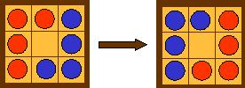

## Enunciado

Estudia y describe gráficamente los movimientos que te hacen falta para intercambiar los lugares de las fichas, llevando las rojas donde están las azules y viceversa, utilizando para ello el menor número de movimientos posible.

Ten en cuenta que tanto las fichas rojas como las azules pueden moverse hacia delante o hacia su derecha y que cada ficha puede moverse a una casilla contigua o saltar por encima de otra de distinto color para ocupar una casilla vacía.

