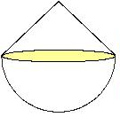

## Enunciado

Una pieza pesada está constituida por un cono y una semiesfera unidos por sus respectivas bases, que son iguales. El radio de ambas es de 4 cm. Se sumerge la pieza en una cubeta que contiene 510 cm³ de agua, apreciándose una subida hasta los 711 cm³. Calcula la altura del cono que forma parte de la citada pieza.

