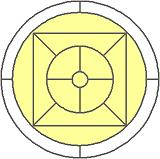

## Enunciado

Queremos construir una cristalera con el diseño de la figura con cristales de cuatro colores: morado, verde, rojo pálido y amarillo, pero no queremos que haya trozos adyacentes del mismo color.

¿Serías capaz de indicarnos qué color podría tener cada trozo?

