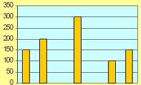

## Enunciado

La figura que veis a continuación es la representación gráfica del viaje de fin de estudios que realizaron los alumnos de 8º de EGB. Observa que salieron el lunes y regresaron el domingo. Pues bien, contesta a las preguntas siguientes:

- ¿Cuántos kilómetros recorrieron en total?

- ¿Señala el día en que recorrieron mayor distancia?

- Indica el día o los días en los que no viajaron.

- ¿A qué distancia de su casa durmieron la última noche?

