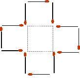

## Enunciado

Con doce cerillas puede construirse una cruz (véase la figura) cuya área es igual a la suma de las de cinco cuadrados. Pues bien, se pide:

a) Con doce cerillas construir una figura cuya área sea equivalente a la de seis cuadrados.

b) También con doce cerillas construir una figura de superficie equivalente a la de 4 cuadrados.

