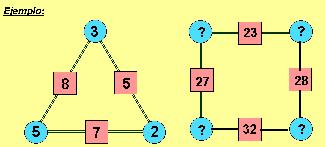

## Enunciado

El número que hay en cada cuadrado debe ser la suma de los números que hay en los círculos contiguos, tal y como ocurre en el ejemplo del triángulo.

Encuentra más de una solución ...

