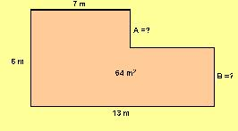

## Enunciado

Para instalar en el Pabellón de Cristal de Madrid el stand de la Junta de Andalucía en la Feria Internacional en la Didáctica, nos han dado un plano y unas medidas. Te pedimos que nos ayudes a averiguar cuánto medirán las longitudes «A» y «B» sabiendo que los ángulos del dibujo son de 90°.

