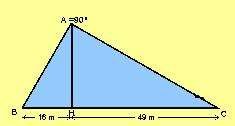

## Enunciado

Disponemos de 800.000 pesetas para cercar un solar con forma de triángulo rectángulo. Si el metro de tapia nos sale a 5000 pesetas, ¿tendremos suficiente? ¿Cuánto dinero nos sobrará o nos faltará?

(Las medidas del solar son las del dibujo)

