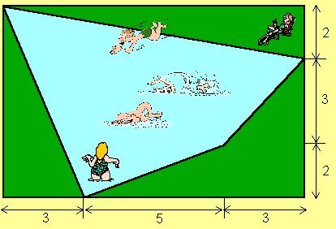

## Enunciado

Para hacer una piscina disponemos de un solar rectangular como el de la figura. Con objeto de dejar un poco de césped a su alrededor y que su forma sea más original, el vaso de la piscina se hizo de forma irregular, tal y como está en el dibujo.

¿Cuál es la superficie de la piscina? (Las medidas en metros las tienes en la figura)

