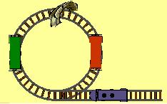

## Enunciado

En la figura podemos ver una vía circular muerta de la estación de Córdoba, donde se hallan dos vagones y una locomotora que se encuentra en la vía principal.

La locomotora puede pasar bajo el puente que también puedes ver, pero los vagones son más altos y no caben por el ojo del puente.

El maquinista desea salir en primer lugar seguido del vagón rojo y luego del vagón verde. ¿Serías capaz de indicarle cómo puede hacerlo?

