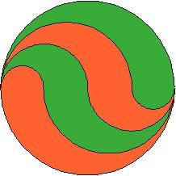

## Enunciado

El cura de mi parroquia está enfadado por la rotura de unas vidrieras del templo por un balonazo.

Ha encargado al cristalero otra igual en verde y rojo.

¿Qué cantidad de cristal de cada color necesitará si se sabe que el radio de la vidriera es de 8 dm?

