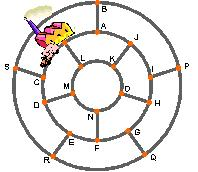

## Enunciado

Una extraña ciudad tiene un sistema de calles circulares y transversales, como indica la figura. En cada empalme de calles hay un despacho de la Central Lechera.

    Demuestra que el repartidor puede salir de la central, recorrer todos los despachos y regresar al depósito sin pasar dos veces por el mismo sitio.

