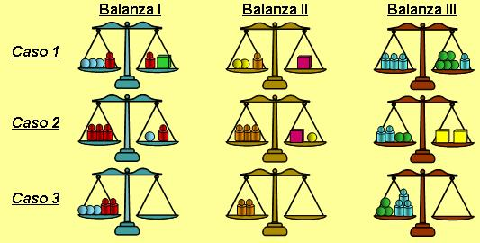

## Enunciado

Aquí tienes tres balanzas con juegos de pesas distintas, que en los dos primeros casos están equilibradas y se pide que con esa información indiques la forma de equilibrar la 3ª situación...

