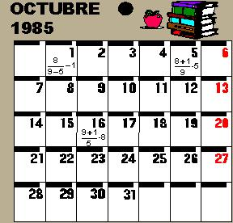

## Enunciado

Mi hermana me ha dicho que le ayude a resolver un pasatiempo que le propuso su profe de Matemáticas.

Consiste en escribir los jueves del mes, combinando las cuatro cifras del año mediante operaciones aritméticas.

Se deben utilizar todas las cifras del año (1,9,8,5) una y sólo una vez.

En la hoja del almanaque tienes algunos ejemplos ...

