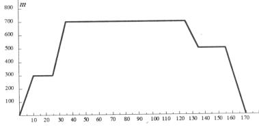

## Enunciado

Pedro va a jugar un partido de fútbol con sus amigos. Sale de su casa y tiene que esperarlos en la plaza. Por fin, van al campo de fútbol y, después del partido, vuelven a su casa; pero entran a un bar a tomar un refresco. Este es el recorrido:

a) ¿Qué distancia hay entre la casa de Pedro y la plaza?

b) ¿Cuánto tiempo están jugando?

c) ¿Cuánto tardaron en tomarse el refresco?

d) Si entran en el campo a las 18 horas, ¿dónde se encontraba Pedro a las 17 horas 30 minutos?

e) ¿A qué hora sale Pedro de su casa?
