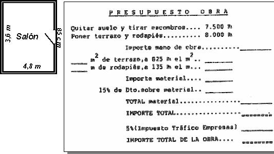

## Enunciado

Con el dinero que obtuvo con la vendimia, mi abuela se ha decidido a arreglar el viejo pavimento del salón de su casa. De momento se conforma con ponerle terrazo y rodapiés nuevos.

Ella ha elaborado un plano y ha pedido presupuesto a una empresa que se dedica a estas cosas. Pues bien, te pedimos que completes los datos del presupuesto.

