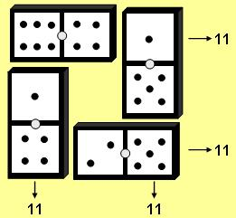

## Enunciado

Cuatro fichas del dominó elegidas convenientemente, pueden colocarse formando un cuadrado con igual número de puntos en cada lado. En la figura puede verse un modelo (11 puntos por lado).

Intenta formar cuatro cuadrados de este tipo con la condición de que los cuatro lados tengan idéntico número de puntos.

