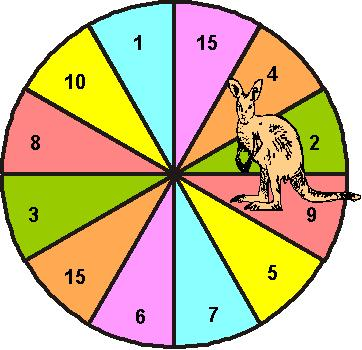

## Enunciado

Un canguro debe obtener saltando 135 puntos siguiendo las siguientes normas:

- Debe partir de la casilla del 2 de la del 9.

- Si da un salto en el sentido de las agujas del reloj realizará una suma.

- Si da 3 saltos en el sentido de las agujas del reloj realizará un producto.

- Si da un salto en sentido contrario al del reloj realizará una resta.

- Si da dos saltos en sentido contrario al reloj realizará una división.

- Debe realizar todas las operaciones ( +, - , x , : ) una vez como mínimo y dos veces como máximo, pero nunca una operación dos veces consecutivas.

