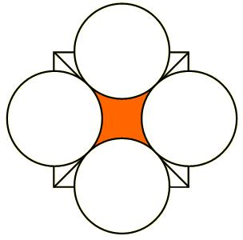

## Enunciado

Determina la superficie coloreada de la figura, teniendo en cuenta que la medida del radio de cada círculo es 1/4 de la longitud del lado del cuadrado y que la diagonal del cuadrado mide 8 cm.

