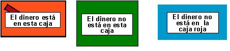

## Enunciado

Se trata de adivinar en cuál de las tres cajas hay un buen montón de dinero. Las tres cajas son de distintos colores y cada una de ellas lleva un mensaje, pero a lo sumo uno de los mensajes es verdadero.

Los mensajes son:

- Caja roja: «El dinero está en esta caja».
- Caja verde: «El dinero no está en esta caja».
- Caja azul: «El dinero no está en la caja roja».

(Explica tu razonamiento)

