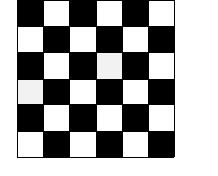

## Enunciado

Un tablero de ajedrez es un cuadrado de 64 cuadraditos (8 × 8).

Utilizando como unidad uno de los cuadraditos de dicho tablero, se ha construido un tablero como el de la figura.

¿Cuántos cuadrados puedes formar en el tablero 6 × 6, variando el número de cuadrados de cada lado?

