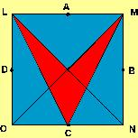

## Enunciado

El lado del cuadrado LMNO tiene una longitud de 20 dm. A, B, C y D son los puntos medios de cada uno de los lados. Hallar la superficie de la punta de flecha de color rojo que se ha obtenido al trazar los segmentos LC y MC y las diagonales LN y MO.

