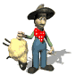

## Enunciado

Don Gonzalo, el maestro del pueblo, visitó al vaquero en una ocasión y al ver tantos becerros, exclamó:

*-¡Cuántos becerros! ¡Lo menos hay dieciocho!*

*-Algunos menos -dijo el vaquero-. Todos provienen de cuatro madres: La blanca, la negra, la pinta y la Carlota y cada una tiene un becerro más que la siguiente.*

*-Pero Marcelo -dijo el maestro-, ¿cuántos hay de cada una?*

*-Hombre Gonzalo, tú que eres maestro debes saberlo. No obstante, te diré que todas tienen más de un becerro.*

Ayuda tú a Gonzalo a saber el número de becerros que tiene Marcelo.

