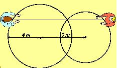

## Enunciado

En mi pueblo se decidió adornar la plaza central con una fuente de dos caños. El diseño consistía en dos pilas circulares (la mayor de 4 metros de radio), secantes. La distancia entre los dos surtidores es de 6 metros. ¿Cuánto medirá la distancia que separa a dos observadores que están situados uno a cada lado de la fuente, en la recta paralela a la que une los dos surtidores y pasa por uno de los puntos de corte de los dos círculos?

