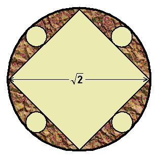

## Enunciado

Un fabricante de turrones decide embalar sus productos en cajas circulares de $\sqrt{2}$ m de diámetro, tal y como muestra la figura. Si la parte marrón representa la parte ocupada por el papel de embalaje, encuentra la superficie útil para el turrón.

