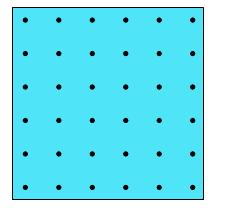

## Enunciado

En la retícula siguiente dibuja todas las figuras poligonales distintas que puedas conseguir cuyos vértices sean puntos de la cuadrícula y que tengan doce unidades de perímetro. Calcula sus áreas.

(Se toma como unidad de área la superficie del cuadrado formado por cuatro puntos adyacentes)

