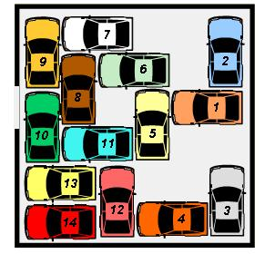

## Enunciado

En un pequeño aparcamiento subterráneo los coches están aparcados como si fueran sardinas. Tan apretados están que solo pueden moverse para atrás y para delante.

El coche número 1 de la figura, pertenece al director de una importante empresa y ¡tiene mucha prisa en salir! Ayuda al encargado a encontrar el número mínimo de coches que deben ser movidos para que este señor pueda salir cuanto antes del atasco.

