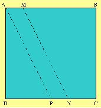

## Enunciado

En un cuadrado ABCD, de 5 dm de lado, se toman los segmentos AM = 10 cm y CN = 15 cm.

Se une M con N y por A se traza la paralela AP al segmento MN.

Determina el área de cada una de las tres partes en que queda dividido el cuadrado.

