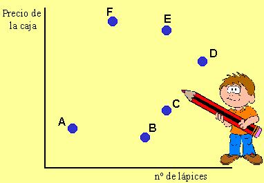

## Enunciado

Cada punto de la siguiente gráfica representa diferentes cajas de lápices compradas en distintas papelerías:

a) ¿Qué lápices salen más baratos, los de la caja F o los de la C?

b) ¿Qué lápices salen más baratos, los de la caja B o los de la C?

c) ¿En qué caja están los lápices más baratos? ¿Por qué?

d) Señala con la letra G otra caja donde cada lápiz tenga el mismo precio que los de la caja E.
