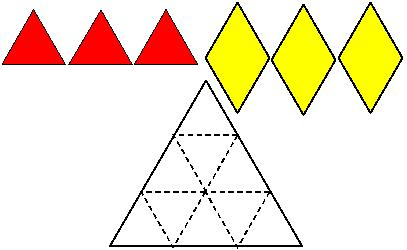

## Enunciado

Se tiene un suelo en forma de triángulo equilátero de 3 m de lado que se quiere cubrir con tres losas que son triángulos equiláteros de 1 m de lado y otras tres con forma de rombo de 1 m de lado y formado con dos triángulos equiláteros. Recubre, si puedes, estos nueve esquemas con las piezas de que dispones.

