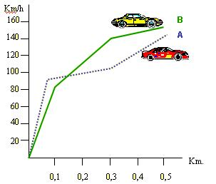

## Enunciado

La siguiente gráfica corresponde a una carrera de prueba de dos nuevos modelos de coches de una determinada marca:

Teniendo en cuenta las magnitudes que relacionan la gráfica, ¿se puede saber de forma inmediata cuál ganó la carrera?

¿Qué coche hizo una mejor salida?

¿Cuánto ha tardado cada coche en recorrer los 100 primeros metros?

¿Qué coche ganó la prueba? Justifica la respuesta.

