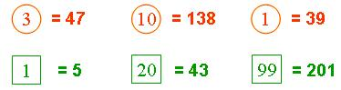
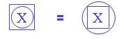

## Enunciado

El círculo y el recuadro representan distintas funciones que actúan sobre el número colocado en el interior de cada una. Si se verifica que:

... entonces encuentra dichas funciones y resuelve la siguiente ecuación:

