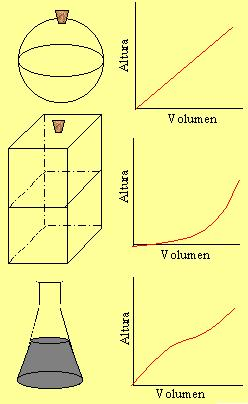

## Enunciado

Las siguientes gráficas representan, para distintos tipos de botellas, la variación de la altura del agua con el volumen que contiene esta. ¿Cuál es la gráfica que corresponde a cada botella?

