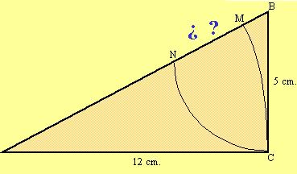

## Enunciado

La figura representa un triángulo rectángulo cuyos catetos miden 12 y 5 cm. Con centro en B se traza un arco de circunferencia de radio BC, 5 cm, que corta a la hipotenusa en N. Análogamente, con centro en A y radio AC, 12 cm, se traza un arco que corta a la hipotenusa en M.

Halla la longitud del segmento MN.

