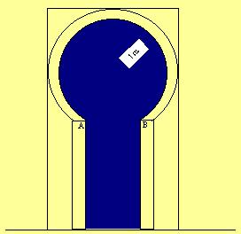

## Enunciado

En la construcción de la Mezquita cordobesa, como en otras construcciones árabes, se utilizó bastante el arco de herradura, cuya forma está basada en el círculo, aunque no llega a ser completo, pero sí supera el semicírculo.

El arco de herradura de la figura está construido de forma que el segmento AB mide 1 metro, igual que el radio del círculo interior, y la altura de las columnas que lo sustentan es de 2 metros.

