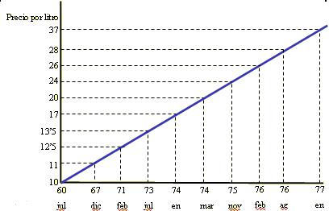

## Enunciado

Se ha querido representar gráficamente la evolución del precio de la gasolina desde julio de 1960 hasta enero de 1977.

    Lamentablemente la gráfica que se ha construido no resulta muy adecuada para mostrar lo ocurrido en este período.

    Así por ejemplo, la llamada «Crisis del Petróleo» de 1976 no se aprecia de un simple vistazo, lo cual no dice mucho en favor de esta representación.

    Explica por qué no es adecuada esta gráfica.

    Representa los datos de acuerdo con los criterios que consideres correctos.

