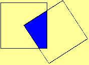

## Enunciado

Dos cuadrados iguales en el plano (cuyo lado mide 2 cm) se mueven de modo que uno de los vértices de uno de ellos es el centro del otro cuadrado. ¿Qué fracción del área del cuadrado corresponde a la superficie rayada?

