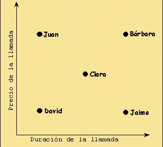

## Enunciado

Un fin de semana, cinco personas hicieron llamadas telefónicas a varias partes del país. Anotaron el precio de sus llamadas y el tiempo que estuvieron en el teléfono en la gráfica de abajo.

¿Quién puso una llamada a larga distancia? Explica con cuidado tu razonamiento.

¿Quién realizó una llamada local? Explícalo.

¿Quiénes hicieron llamadas a la misma distancia aproximadamente? Explícalo de nuevo.
