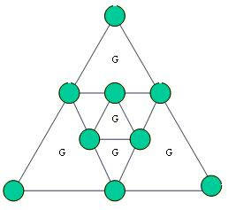

## Enunciado

Repartir los 45 prisioneros de esta fortaleza en las 9 celdas redondas de manera que cada uno de los cuatro guardias tenga bajo su vigilancia 17 prisioneros. Ninguna celda está vacía. Es preciso que cada uno de los cuatro guardias indicados por la inicial «G» vigile las celdas situadas alrededor de la pieza triangular dentro de la cual están situados. Dos celdas distintas no pueden contener el mismo número de prisioneros.

