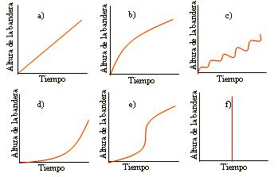

## Enunciado

Cada mañana, en el campamento de verano, el boy scout más joven tiene que izar la bandera a lo alto del mástil.

I) Explica con palabras qué significaría cada una de las siguientes gráficas.

II) ¿Qué gráfica muestra la situación de forma más realista?

III) ¿Qué gráfica es la menos realista?

