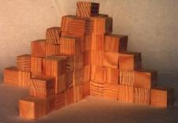

## Enunciado

a) Como puedes ver, esta torre tiene una altura de 6 cubos. ¿Cuántos cubos son necesarios para construirla?

b) ¿Cuántos cubos son necesarios para construir, en cada caso, torres como esta pero de 7, 8, 9 o 10 cubos de altura, respectivamente?

c) Si la torre se construye con 325 cubos, ¿qué altura crees que tiene? Explica cómo has encontrado esta altura.

d) ¿Cómo calcularías el número de cubos necesarios para una torre de 800 cubos de altura? ¿Y para una altura cualquiera? Explícalo.
