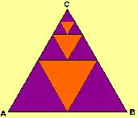

## Enunciado

En la figura adjunta se pueden reconocer varios triángulos equiláteros; el mayor de todos contiene a los demás y los tres triángulos destacados en naranja han sido construidos uniendo los puntos medios de los lados de aquellos en los que se encuentran inscritos.

Sabiendo que el área del triángulo ABC es de 1024 metros cuadrados, has de encontrar:

a) La suma de las áreas de los triángulos anaranjados.

b) El área del cuarto triángulo que se podría construir por este procedimiento.
