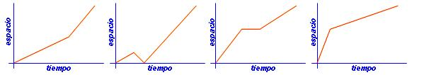

## Enunciado

Muchos chavales de Fuente Victoria van al Instituto de Fondón y suelen ir en bicicleta o en moto.

La primera clase empieza a las nueve y media por lo que la mayor parte de estos chicos y chicas salen de clase a las ocho y media, porque llegar tarde ...

La distancia de Fuente Victoria al instituto es de (casi) 10 kilómetros.

Las cuatro gráficas siguientes muestran cómo el viaje al instituto es distinto para Fernando, Herminia, Maruja y Yolanda. Y en los relatos, cada uno explica las circunstancias de su viaje ...

Yolanda: Yo siempre salgo con calma. Porque, yo me digo, a estas horas de la mañana no te puedes precipitar ... Ya en el camino empiezo a pedalear más deprisa, porque no me gusta llegar tarde.

Herminia: Acababa de salir de casa cuando me di cuenta de que teníamos gimnasia y me había dejado el chándal y las zapatillas. Qué tonta, ¿verdad? Otra vez a casa a buscarlos. Después tuve que pedalear muy deprisa para llegar a tiempo.

Fernando: Esta mañana con la motocicleta al cole ... ¡guay del Paraguay! Bien rápido. Pero por el camino: ¡plof, plof, sin gasolina! Y yo, ¡hasta la coronilla! Motocicleta en la mano y andando el resto del camino. Llegué por los pelos ...

Maruja: ???

a) ¿A quién corresponde cada gráfica?

b) Imagínate lo que puede haber dicho Maruja. ¿Qué supones que ocurrió en su viaje?
