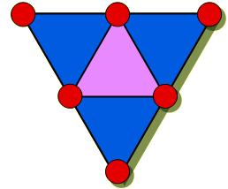

## Enunciado

Coloca los números 0, 1, 2, 3, 4 y 5 en el interior de los círculos de modo que sea igual la suma de los situados en los vértices de cada triángulo. Encuentra dos soluciones (no importa que la suma sea distinta).

Si el radio mide 1, y el lado de cada triángulo 8, averigua el perímetro de la región coloreada en azul.

Y ya que estás puesto/a, halla también el área de la región azul.

