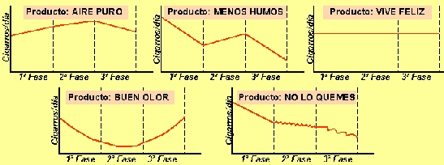

## Enunciado

Cinco laboratorios farmacéuticos proponen una terapia para dejar de fumar usando productos diferentes con tratamientos en tres fases:

- Fase de choque: En la que se toma una dosis de producto al día.

- Fase de choque: En la que se toma la dosis en días alternos.

- Fase de choque: Sólo se toma el producto una vez a la semana.

Según los experimentos realizados el efecto de cada tratamiento es el siguiente:

a) Danos tus conclusiones sobre la eficacia de cada uno de los productos.

b) Indica cuál debería ser la gráfica del producto perfecto.
