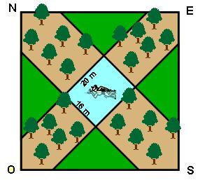

## Enunciado

Sobre un terreno cuadrado de 32 áreas, cuyos lados están orientados NO-SE y NE-SO, se encuentra una piscina rectangular de 16 × 20 m, cuyos lados dan a los cuatro puntos cardinales: N, S, E y O.

    El centro de la piscina coincide con el centro del terreno. El resto del terreno está sembrado una parte de árboles y otra de césped, rellenando éste los cuatro triángulos que hay dentro del cuadrado. Se pide qué proporción del terreno está sembrado de césped.

