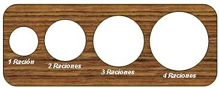

## Enunciado

Pepino el cocinero tiene una plantilla para medir la cantidad de espaguetis necesaria según el número de personas. Esta plantilla consiste en una tabla con agujeros circulares de diferentes tamaños. El manojo de espaguetis que se puede pasar por el círculo, sería la cantidad apropiada para el número de personas correspondiente.

Pues bien:

a) ¿Cómo se podría saber si la relación es la correcta?

b) Estudia y dibuja un clasificador para 5, 6, 7, 8, 9 y 10 personas.

