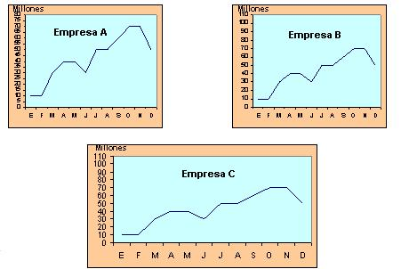

## Enunciado

Las ganancias de tres empresas A, B y C vienen representadas por las siguientes gráficas.

Obsérvalas y di cuál de ellas ha obtenido mayores y menores beneficios. Razona las respuestas.

