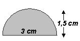

## Enunciado

Una empresa de publicidad ha diseñado unos «pims» para los Campeonatos del Mundo de Esquí Alpino de Sierra Nevada 98, cuya silueta y tamaño se observa en la figura adjunta. Para la confección del mismo se utilizan planchas metálicas rectangulares de 1,5 m por 75 cm, siendo el coste de cada pieza de 2500 ptas. Como buenos comerciantes, cortan las chapas de forma que se aproveche al máximo el material, aunque no toda la chapa se pueda utilizar.

a) ¿Cuál es el máximo número de pims que podrán sacar de una plancha?

b) ¿Qué superficie se aprovecha y cuánta se desperdicia?

c) A la diseñadora le han pagado 100 000 ptas y la confección del molde de grabado y esmaltación ha costado 15 000 ptas. Sabiendo que esmaltar un pims cuesta 25 ptas y el sistema de sujeción 7 ptas, si se hiciese un solo pims, ¿cuánto habríamos pagado por él?

d) ¿Cuánto costaría cada pims si las tiradas fuesen de 5000, 10 000 o 100 000 pims respectivamente?

e) La 1.ª tirada fue de 10 000. Sabiendo que el fabricante cargó un 20 % a los costes materiales en concepto de otros gastos, y un 50 % de beneficio al total de los gastos, ¿cuál es el precio de venta en fábrica de un pims de esta primera tirada?
