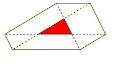

## Enunciado

En una casa existe una piscina (T) de forma triangular como la de la figura, cuya superficie mide 140 m². Pretendemos ampliar la piscina y para ello trazamos el simétrico de cada vértice del triángulo respecto a cada uno de los demás vértices, obteniendo así una nueva piscina de forma hexagonal como la de la figura. ¿Cuál es la superficie de esta nueva piscina?

